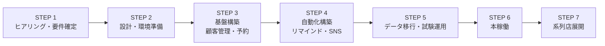

# FREEWAN大阪北区店 システム導入プロセス（概要）

要件定義書（`要件定義書.md`）の内容を実現するまでの流れ。期間は目安。

## 全体の流れ

## STEP 1: ヒアリング・要件確定（7/30 訪問 〜 約1週間）

- 7/30 11:30 訪問。要件定義書の「確認したい事項10項目」を店舗とすり合わせ
- 現行スプレッドシート（カルテ・スクール記録・ワクチン管理・回数券）の実物を確認
- EPARKの予約通知メールのサンプル入手
- 予約一元化の方針決定（案A: 自社カレンダー集約 を推奨）
- → 要件定義書を確定版に更新

## STEP 2: 設計・環境準備（約1〜2週間）

- データ設計（顧客・ペット・カルテ・予約・回数券/会員・シフト・売上）
- 画面設計（予約カレンダー、顧客ページ、ダッシュボード、シフト入力）
- リマインドR1〜R8の文面・送信チャネルを店舗と確定
- アカウント準備: LINE公式（Messaging API）、Instagram（ビジネスアカウント連携）

## STEP 3: 基盤構築 — 顧客管理・予約（約3〜4週間）

- 顧客管理・カルテ（来店履歴、来店経路、ワクチン情報）
- 予約カレンダー（シフト反映、選択式シフト入力）
- EPARK通知メールの自動取り込み
- 回数券・会員（月4/月8）の残回数・持ち越し・失効管理

## STEP 4: 自動化構築 — リマインド・集計・SNS（約3〜4週間）

- リマインドエンジン R1〜R8（顧客向けLINE/メール、スタッフ通知）
- ダッシュボード（当月入園数・体験入園数・当月来園数、トリマー実績、失効数）
- SNS自動投稿（10枚超の自動2分割、リール対応）

## STEP 5: データ移行・試験運用（約2週間）

- 現行スプレッドシートから顧客・カルテ・回数券データを移行
- スタッフ操作レクチャー（入力は選択式中心なので短時間を想定）
- 並行運用: リマインドはまずスタッフ確認付きで送信 → 問題なければ全自動へ

## STEP 6: 本稼働

- 旧運用（スプレッドシート手入力・手動ワクチン管理）を停止
- 稼働後1ヶ月は集計値の突き合わせ・調整期間とする

## STEP 7: 系列5店舗への展開（本稼働後）

- 北区店での運用実績をもとに、店舗別の差分（予約経路・メニュー・プラン）をヒアリング
- マルチ店舗構成のため、店舗追加は「設定＋データ移行」のみで展開可能な設計とする

## 目安スケジュール

| 時期 | 内容 |
|---|---|
| 7月末 | STEP 1: 7/30訪問・要件確定 |
| 8月前半 | STEP 2: 設計・環境準備 |
| 8月後半〜9月 | STEP 3: 顧客管理・予約 |
| 9月〜10月前半 | STEP 4: リマインド・集計・SNS |
| 10月後半 | STEP 5: 移行・試験運用 |
| 11月〜 | STEP 6: 本稼働 → STEP 7: 系列店展開の検討 |

※ LINE公式・InstagramのAPI申請/審査に時間がかかる場合があるため、STEP 2で早めに着手する。
