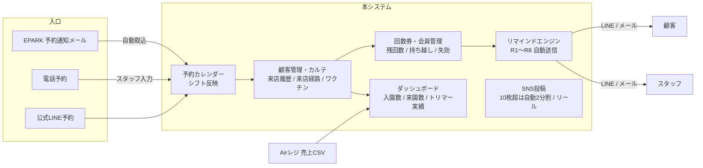

# FREEWAN大阪北区店 ペットサロン＆スクール管理システム 要件定義書（ドラフト）

- 作成日: 2026-07-24
- 次回訪問: **2026-07-30（木）11:30**
- ステータス: ヒアリング内容の整理ドラフト（7/30訪問時に確認・確定）
- 展開可能性: うまくいけば **系列5店舗** へ横展開の可能性あり（マルチ店舗前提の設計を意識する）

---

## 1. 現状（As-Is）

| 項目 | 現状 | 課題 |
|---|---|---|
| サロンのカルテ | Googleフォーム → スプレッドシートで管理 | 履歴が蓄積しづらく、検索・参照性が低い |
| スクールの記録 | スプレッドシートに手入力 | 入力負荷・記入漏れ |
| ワクチン接種情報 | 年1回、手動で情報更新。対象者はスプレッドシートの関数で色変え | 手動運用のため**漏れが発生** |
| レジ | Airレジ | — |
| 予約カレンダー | レストランボード（特にこだわりなし） | — |
| 集客経路 | EPARKがメイン。他に少数の電話予約・EPARKのTEL予約・公式LINE予約 | **EPARK側の空き枠更新をすっぽかす**ことがある（レストランボードは漏れない） |
| 来店履歴 | 残せていない | 店舗の来店履歴を残したい |

## 2. 要件（To-Be）

### 2.1 顧客管理・カルテ

- サロンカルテ・スクール記録を一元管理（現行のGoogleフォーム/スプレッドシート運用から移行）
- **来店履歴**を店舗単位で記録・参照できること
- **来店経路**（EPARK / 電話 / EPARK TEL / 公式LINE など）を記録し、集計できること
- ワクチン接種情報の更新管理を自動化し、**対象者の抽出漏れをなくす**
  - アナウンス対象は「**直近半年以内の利用者**」に絞る
  - 対象者本人へのリマインドに加え、**スタッフへメールまたはLINEで通知**
- **スクールの月内利用回数**を顧客情報ページ上で確認できること

### 2.2 予約管理

- 予約経路: EPARK（メイン）、電話、EPARKのTEL予約、公式LINE
- 現在はレストランボードで管理しているが、EPARKの空き枠更新漏れが発生するため、
  **「1つのシステムに集約」または「同期して1つのカレンダー操作にまとめる」** ことが目標
  - ※ レストランボード自体へのこだわりはない
- **予約カレンダーにスタッフのシフトを反映**する
- シフト入力は選択式（プルダウン等のワンタッチ入力）で以下の区分に対応:
  - AM半休 / PM半休 / 公休 / 有休 / 数時間休（時間指定）

### 2.3 リマインド・通知（自動化の中核）

| # | トリガー | 対象 | 内容 |
|---|---|---|---|
| R1 | 予約の**前々日** | 予約者 | 予約リマインド |
| R2 | 誕生日 | 顧客（ペット） | 誕生日メッセージ |
| R3 | ワクチン更新時期 | 直近半年以内の利用者 | 接種案内 ＋ スタッフへメール/LINE通知 |
| R4 | 体験スクール利用の**3日後** | 体験者**全員** | 体調の伺い |
| R5 | 体験スクール利用の3日後〜 | 入園未定者、入園済みでも次回来店日未定者 | 追客（フォローアップ） |
| R6 | 回数券利用者が**2週間以内に1度も来店なし**（期限2ヶ月） | 該当者 | 来店促し ＋ **残回数**の通知 |
| R7 | スクール会員（月4回/月8回）が**1週間来店なし** | 該当者 | 来店促し ＋ **月内残回数**の通知 |
| R8 | 翌月への持ち越しが発生 | 持ち越し客 | 持ち越し分の消化リマインド |

**体験スクール後の3パターン（R4/R5の状態管理）**

1. 入園決定 ＋ 次回来店日も決定 → 体調伺いのみ
2. 入園決定、次回日程は未定 → 体調伺い ＋ 追客
3. 入園も次回予定も未定 → 体調伺い ＋ 追客

**回数消化のルール（R6〜R8の前提）**

- 回数券の有効期限は **2ヶ月**
- スクール会員は **月4回 / 月8回** の2プラン
- 未消化分は**翌月まで持ち越し可**。ただし消化順は「**当月分を優先消化 → その後に振替（持ち越し）分**」
- **振替できなかった（失効した）回数**は、店舗全体の集計に加えて**顧客ごとに履歴として保持**する
  - 保持する項目: 失効日 / 内訳（スクール何月分の振替か、回数券か）/ 失効回数
  - 顧客情報ページに「累計失効回数」と失効履歴の一覧を表示する（過去12ヶ月・年度別の集計も併記）
  - 失効が続く顧客は来店頻度が落ちているサインのため、追客の判断材料として使う

### 2.4 集計・ダッシュボード

- スプレッドシート（または移行後のDB）から以下を一覧で分かりやすく表示:
  - **当月入園数**
  - **体験入園数**
  - **当月来園数**
- **トリマーのみ**の個人実績:
  - 月の施術数
  - 新規と既存顧客それぞれの施術件数
  - 貢献売上
- 来店経路別の集計（2.1参照）
- 振替失効数の集計（2.3参照）

### 2.5 SNS自動投稿

- 写真を**10枚以上**投稿したい（現状10枚が上限）
- 上限を超える場合、**写真を自動で2回に分けて投稿**できるようにしたい
- **リール動画**も投稿したい

## 3. 技術的な実現性の評価（現時点の見解）

### 3.1 SNS投稿（Instagram想定）

- **カルーセルの10枚上限はInstagram側（API）の仕様**のため、1投稿10枚超は不可。
  → **11枚以上を自動で2投稿に分割**する方式で対応可能（要望どおりの「二回に分ける」を自動化）。
- **リール動画はAPI経由での自動投稿に対応**（Instagramコンテンツ公開API、media_type=REELS）。動画の長さ・形式（縦型、上限時間など）の制約内であれば可能。

### 3.2 予約の一元化

- **レストランボード・EPARK・Airレジはいずれも一般公開されたAPIがない**ため、「既存サービス同士を裏で自動同期」は原則できない（規約的にもスクレイピング連携は非推奨）。
- 現実的な選択肢は次の2案。7/30に方針をすり合わせたい:
  - **案A（推奨）: 自社予約カレンダーに集約。** 電話・LINE予約はスタッフが自社カレンダーへ入力。EPARK予約はEPARKからの通知メールを取り込んで自動反映（通知メールのパース）し、空き枠の更新忘れはリマインド通知で防止。
  - **案B: レストランボードを継続**し、自社システムは顧客管理・リマインドに特化。予約データは手動転記が残る。
- Airレジは会計・売上用として継続利用可（売上データはCSVエクスポート等での取り込みを想定）。

### 3.3 通知チャネル

- 顧客向け: **LINE公式アカウント（Messaging API）** を軸に、必要に応じてメール/SMS
- スタッフ向け: **メール ＋ LINE通知** の両対応が可能

### 3.4 その他

- 現行スプレッドシートからの**データ移行**（カルテ・会員・回数券）は初期構築時に実施
- 系列5店舗展開を見据え、**店舗を切り替えられるマルチ店舗構成**で設計する

## 4. 7/30 訪問時に確認したい事項

1. **予約一元化の方針**: 案A（自社カレンダー集約）/ 案B（レストランボード継続）どちらにするか。EPARKの予約通知メールのサンプルを見せてもらえるか。
2. **LINE公式アカウントの現状**: 友だち数、Messaging APIの利用可否（プラン）、顧客のLINE登録率。
3. **現行スプレッドシートの実物**: カルテ項目、スクール記録、ワクチン管理表、回数券管理の項目を確認（データ移行の設計に必要）。
4. **リマインドの文面と送信チャネル**: 各リマインド（R1〜R8）をLINE/メールどちらで送るか。誕生日は犬の誕生日か飼い主か（両方か）。
5. **「数時間休」の入力粒度**: 30分単位か1時間単位か。シフトは誰が入力するか（本人/店長）。
6. **トリマー実績の「貢献売上」の定義**: 指名売上のみか、担当施術の売上合計か。物販は含むか。
7. **SNS投稿の対象**: Instagramのみか、他SNS（X、Facebook等）も対象か。投稿文はテンプレートか都度入力か。
8. **体験スクール追客の期間・回数**: 3日後の初回以降、何日おきに何回まで追うか。
9. **回数券・会員の運用詳細**: 回数券の回数バリエーション、期限の起算日（購入日/初回利用日）、月をまたぐ扱いの例外。
10. **5店舗展開時の共通/個別要件**: 各店で予約経路・メニュー・プランが異なるか。

## 5. 想定システム構成（たたき台）

- カルテ入力は現行のGoogleフォーム運用を活かしつつ、段階的に本システムのフォームへ移行する想定。

---

*本ドキュメントはヒアリングメモをもとにしたドラフトです。7/30の訪問で内容を確認・確定します。*
